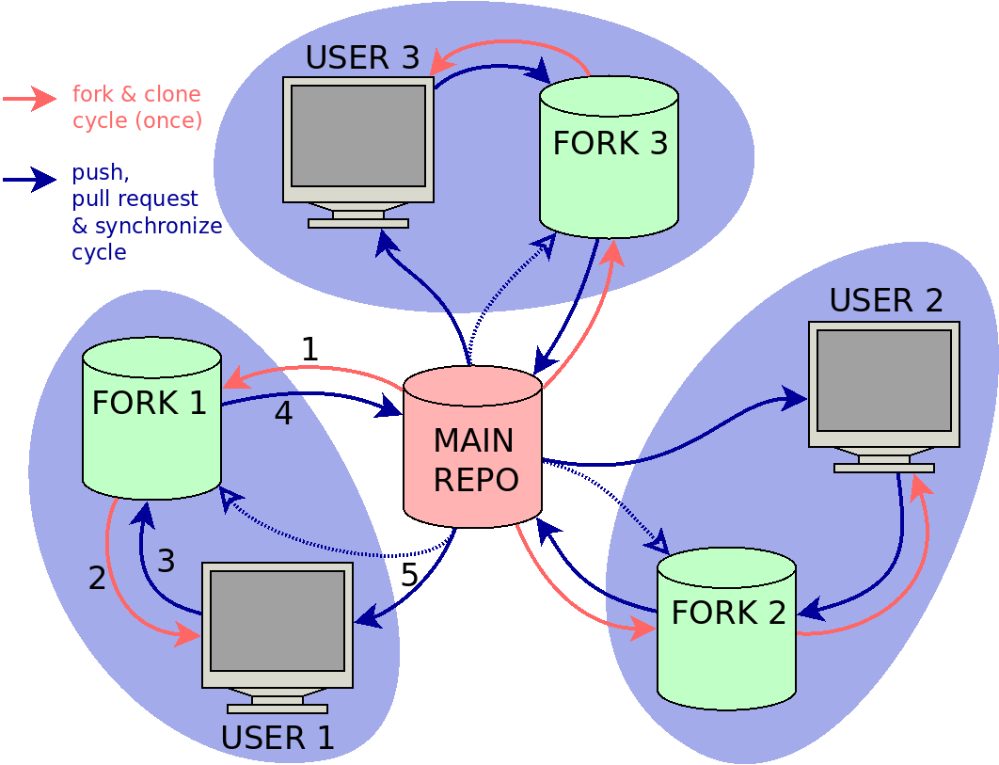
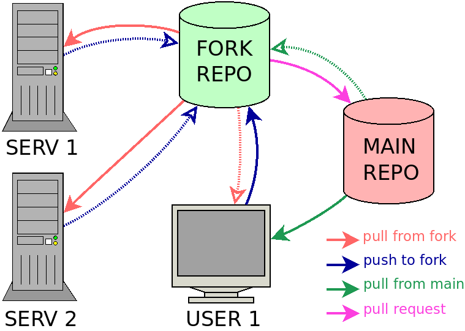

.. _fork_workflow:

Workflow with GitHub forks
==========================

The recommended workflow for NorESM code contributions is based on using a
`personal fork repositories
<https://docs.github.com/en/pull-requests/collaborating-with-pull-requests/working-with-forks/about-forks>`_
of the main NorESM repository in GitHub, which is then cloned to a location were
code development and testing can be performed (local computer or HPC server).
This procedure follows the guidelines set out in the coderefinery tutorial on
`distributed version control and forking workflow
<https://coderefinery.github.io/git-collaborative/03-distributed>`_.

.. _(Fig. 1):

   **Figure 1:** Collaborative fork-based workflow with three users.

:ref:`Figure 1<(Fig. 1)>` shows an example where three users are collaborating
with code contributions to a main repository using a fork-based workflow.
The workflow passes through the following steps:

#. `Fork the main repository
   <https://docs.github.com/en/get-started/quickstart/fork-a-repo>`_ to a new
   fork repository on GitHub. (first time)
#. `Clone the fork repository
   <https://docs.github.com/en/get-started/quickstart/fork-a-repo#cloning-your-forked-repository>`_
   to a local computer or HPC server. (first time)
#. After making code changes, push code changes to fork repository.
#. Create a pull request to push code changes from fork repository to the main
   repository.
#. Synchronize local clone (and/or fork repository) with recent changes from the
   main repository.

Keep local clone in sync with main repository
'''''''''''''''''''''''''''''''''''''''''''''

When cloning a GitHub repository, the local clone will refer to the original
source as ``origin`` and branches in the original source by ``origin/<branch>``,
(e.g. ``origin/master``). For the fork-based workflow, ``origin`` will refer to
the personal fork, but it is also useful to be able to sync with the main
repository, often referred to as ``upstream`` (we keep to these naming
conventions hereafter). Connections to remote repositories are managed by ``git
remote``
::

  git remote -v    # List all remote repositories

The ``git remote`` command supports both adding and deleting references to
external git repositories. In additions to ``upstream`` it is also possible to
include references to the forks used by collaborators, for short code testing or
longer term collaboration. To add a reference to ``upstream``
::

  git remote add upstream https://github.com/NorESMhub/NorESM.git

To get the latest version of ``master`` from ``upstream``
::

   git pull upstream master

Make code changes
'''''''''''''''''

A typical cycle for making code changes have the follow steps:

#. Make sure your code base is updated with the latest source files
#. Pull changes from ``upstream`` if necessary
#. Check out a feature branch for your code changes
#. Make your changes and commit to the feature branch
#. Push the feature branch to ``origin`` repository
#. Create a pull request to ``upstream`` repository
#. Remove temporary feature branches after this has been merged with ``upstream``

In a practical session, this can involve running the following commands
::

   git fetch --all               # Update commit log for all remote git repositories
   git pull upstream master      # pull latest from the upstream master branch; do it often if possible
   git push origin master        # do this when upstream is ahead of you local (origin) repos, to stay in sync.
   git checkout -b my-feature    # create and switch to a new branch "my-feature".
   ...                           # edit some code
   git commit -a -m "Add first draft of my feature"
   git push

Make changes directly in GitHub
'''''''''''''''''''''''''''''''

For changes that do not need testing (e.g. changes to documentation), it can be
more convenient to edit files directly in GitHub. It is still recommend to work
on a personal fork, make a feature branch and create a pull request to merge the
changes with the main repository, as you would do when working from a local
clone repository. See `GitHub docs <https://docs.github.com/en>`_ for procedures
on how to `sync a fork from the web user interface
<https://docs.github.com/en/pull-requests/collaborating-with-pull-requests/working-with-forks/syncing-a-fork#syncing-a-fork-from-the-web-ui>`_,
and how to `edit a file in GitHub
<https://docs.github.com/en/repositories/working-with-files/managing-files/editing-files>`_.

Pull requests and code merging
''''''''''''''''''''''''''''''

You are now ready to make a pull request of my-feature branch. This can by done
from github after you pushed. Remember that after the PR is created and reviewed
by others, you may need to go back and fix things before it is accepted and can
be merged. After merging the PR, you should normally delete the feature branch
and update your local repos. to keep things clean. It will still be seen as a
(merged) branch in the upstream repository.

**Note**: If your feature branch has many commits, it may be smart to "squash"
 the history before creating the PR, so that it is easier to review the full
 changes by others (and yourself). This can be done using the **git rebase**
 command, but this will not be covered here.

Synchronize local repositories through a GitHub fork repository
'''''''''''''''''''''''''''''''''''''''''''''''''''''''''''''''

.. _(Fig. 2):

   **Figure 2:** Synchronize code changes between local git repositories through a shared GitHub fork repository.

A GitHub fork repository can serve as a synchronization point for code testing,
if this is carried out on multiple platforms (e.g. a local machine in addition
to one or more HPC systems). Normally development will take place on only one of
the platforms (e.g. a local machine), and all other platforms are used only for
testing (solid line arrows in :ref:`Fig. 2<(Fig. 2)>`). However, the system also allows
code changes to travel the other direction, e.g. if a bug fix is introduced
during a test run (stippled arrows in :ref:`Fig. 2<(Fig. 2)>`).

Removing feature branches after merging
'''''''''''''''''''''''''''''''''''''''

After a feature branch has been merged with ``master`` in the main repository,
it is useful to clean up local clones and the GitHub fork repository by removing
the feature branch. The fork copy can be removed with an option from the pull
request, after the branch merging has completed, but the clone will still have a
log reference to the remote feature branch. References to outdated remote
branches are removed by using the ``--prune`` flag when fetching remote updates
::

   git fetch --all --prune

If the feature branch was merged using the ``squash and merge`` or ``rebase and
merge`` option, there will not be a merge commit in the log history to indicate
that the feature branch was merged. In this case the feature branch should be
deleted using the ``-D`` flag (short for ``--delete --force``)
::

   git branch -D my-feature
