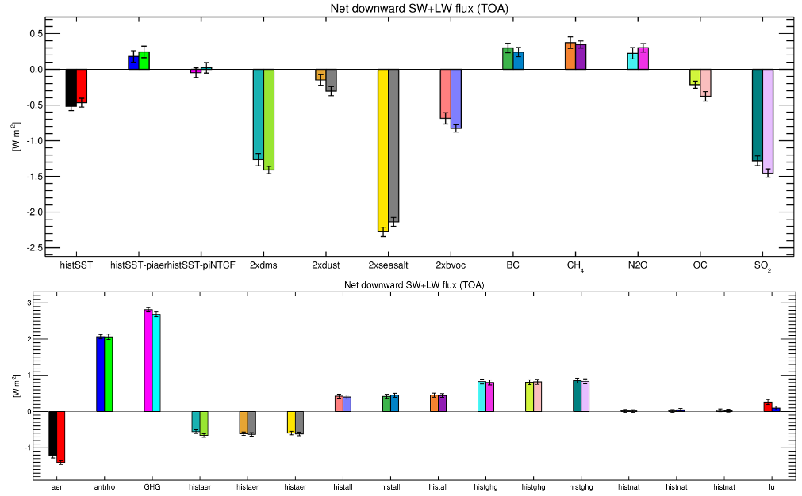

.. _cmip6_data:

CMIP6 archive of NorESM results
================================

| NorESM2 contributes to the 6th phase of the Coupled Model Intercomparison Project (CMIP6; Eyring et al., 2016):   
| https://www.wcrp-climate.org/wgcm-cmip/wgcm-cmip6   
| 

**CMIP6:** 

 * Project under World Climate Research Programme (WCRP)
 * Since 1995 CMIP has coordinated climate model experiments
 * Defines common experiment protocols, forcings and output.
 * More than 40 model groups participate

**Advantages:**
 * Several models perform the same experiments (enabeling comparisons across models and multi-model ensembles)
 * Homogenized and standardized outputs (including variable names). More specifically, all data is in compliance with the standards of the Climate Model Output Rewriter (CMOR).

Data access
^^^^^^^^^^^^^^

The Earth System Grid Federation (ESGF)
+++++++++++++++++++++++++++++++++++++++++

**All data is CMOR-ized and public available here:**
https://esg-dn1.nsc.liu.se/search/cmip6-liu/

The (Norwegian) National Infrastructure for Research Data (NIRD)
+++++++++++++++++++++++++++++++++++++++++++++++++++++++++++++++++
 
**All NIRD users can access the archive of CMOR-ized CMIP6 data by NorESM** under project NS9034K::

   /projects/NS9034K/CMIP6/
   
This is the same data that you can access through the ESGF. Note data is organized by the different contributions/MIPs. The DECK and historical simulations are located under "CMIP".

**All NIRD users can access CMOR-ized CMIP6 data from multiple models under:** :: 

   /projects/NS9252K/ESGF_betzy/

, which has the same structure as data in /projects/NS9034K/CMIP6. Note only members of NS9252K, a NFR storage project for KeyCLIM have write permission.

Refer to Section: :ref:`cmip_other` for more information on how to access and download new data.

**NIRD users that are members of NS9560K (NFR storage project for INES) can access most of the raw (non-CMOR-ized) model data under**::

   /projects/NS9560K/noresm/cases/ 
   
If you are a NIRD user, but not a member of this project, and would like to request access, contact mben@norceresearch.no.

.. note::
   **CMIP6 data errors:** If you encounter data errors/problems, please refer to the :ref:`cmip6_data_faq.rst` section

DECK contributions
^^^^^^^^^^^^^^^^^^
NorESM2 contributions to the CMIP6 Diagnostic, Evaluation and Characterization of Klima (DECK) and CMIP6 historical simulations

.. list-table:: 
   :widths: 25 35 40
   :header-rows: 1
    
   * - Exp. short name
     - Exp. long name
     - NorESM2 version (members)
   *  - amip
      - a historical Atmospheric MIP simulation
      - NorESM2-LM (1), NorESM2-MM (1)
   * - piControl
     - pre-industrial control simulation
     - NorESM2-LM (1), NorESM2-MM (1)
   * - historical
     - historical 
     - NorESM2-LM (3), NorESM2-MM (1)
   * - abrupt-4xCO2
     - forced by an abrupt quadrupling of atmospheric CO2
     - NorESM2-LM (1), NorESM2-MM (1)
   * - 1pctCO2
     - forced by a 1 % pr. year atmospheric CO2 increase
     - NorESM2-LM (1), NorESM2-MM (1)

MIPs contributions
^^^^^^^^^^^^^^^^^^^

.. list-table:: 
   :widths: 25 35 45 15
   :header-rows: 1

   * - MIP short name
     - MIP long name
     - NorESM2 version
     - Contact person(s)*
   * - CMIP
     - Coupled MIP
     - NorESM2-LM, NorESM2-MM
     - ØS, TT, DJLO
   * - AerChemMIP
     - Aerosols and Chemistry MIP
     - NorESM2-LM
     - DJLO, MS
   * - C4MIP
     - Coupled Climate Carbon Cycle MIP
     - NorESM2-LME
     - JS, JT
   * - CDRMIP	   
     - The Carbon Dioxide Removal MIP
     - NorESM2-LM
     - JT, JS
   * - CFMIP
     - Cloud Feedback MIP
     - No contribution yet
     - TS, ØS
   * - DAMIP
     - Detection and Attribution MIP
     - NorESM2-LM
     - ØS
   * - DCPP
     - Decadal Climate Prediction Project
     - NorCPM1
     - NK, FC
   * - GeoMIP
     - Geoengineering MIP
     - No contribution yet
     - HM
   * - LUMIP
     - Land-Use MIP
     - No contribution yet
     - HL
   * - OMIP
     - Ocean MIP
     - NorESM2-LM
     - MB, JS
   * - PAMIP
     - Polar Amplification MIP
     - NorESM2-LM
     - LSG, MB
   * - PMIP
     - Paleoclimate MIP
     - NorESM1-F, NorESM2-LM
     - CG, ZZ
   * - RFMIP
     - Radiative Forcing MIP
     - NorESM2-LM, NorESM2-MM
     - AK, DJLO
   * - ScenarioMIP
     - Scenario MIP
     - NorESM2-LM, NorESM2-MM
     - MB, MS
   * - SIMIP
     - Sea Ice MIP
     - No contribution yet
     - JBD
   * - ZECMIP	   
     - Zero Emissions Commitment MIP
     - NorESM2-LM
     - JS, JT

\* 
**MB**: Mats Bentsen <mats.bentsen@uni.no>,
**FC**: Francois Counillon <francois.counillon@nersc.no>,
**JBD**: Jens Boldingh Debernard <jensd@met.no>,
**LSG**: Lise Seland Graff <lisesg@met.no>,
**AK**: Alf Kirkevag <alfk@met.no>,
**NK**: Noel Keenlyside <noel.keenlyside@gfi.uib.no>,
**HL**: Hanna Lee <hanna.lee@uni.no>,
**HM**: Helene Muri <helene.muri@ntnu.no>,
**DJLO**: Dirk Jan Leo Olivie <dirkjlo@met.no>,
**TT**: Thomas Toniazzo <thomas.toniazzo@uni.no>,
**JS**: Jörg Schwinger <jorg.schwinger@norceresearch.no>,
**MS**: Michael Schultz <michaels@met.no>
**TS**: Trude Storelvmo <trude.storelvmo@geo.uio.no>,
**ØS**: Øyvind Seland <oyvind.seland@met.no>,
**JT**: Jerry Tjiputra <Jerry.Tjiputra@norceresearch.no>,
**CG**: Chuncheng Guo <chgu@norceresearch.no>,
**ZZ**: Zhongshi Zhang <zhzh@norceresearch.no>,

| Overview CMIP6-Endorsed MIPs:
| https://www.wcrp-climate.org/modelling-wgcm-mip-catalogue/modelling-wgcm-cmip6-endorsed-mips

RFMIP and AerChemMIP simulations with different physics (rxi1p1f1 and rxi1p2f1)
^^^^^^^^^^^^^^^^^^^^^^^^^^^^^^^^^^^^^^^^^^^^^^^^^^^^^^^^^^^^^^^^^^^^^^^^^^^^^^^^^^^^^
**Context**

For many of the RFMIP and AerChemMIP simulations with NorESM2-LM, two different simulations are available on ESGF: rxi1**p1**f1 and rxi1p2f1 (with x = 1, 2 or 3). The **p1**- and **p2**-simulations (where p stands for physics) differ in the way the fluxes of heat, momentum and moisture between the atmosphere and the ocean are calculated, and in the use of the solar zenith angle for the calculation of the albedo. The rxi1p2f1 simulations use
the same paramaterisation as the fully-coupled NorESM2-LM simulations, whereas the rxi1p1f1 simulations use the standard approach of CESM2.

**Advice**

1. As the **rxi1p2f1** atmosphere-only simulations are more similar to the fully-coupled simulations, they are the preferred simulations to explain and illustrate the behaviour of the fully-coupled simulations.

2. The atmosphere-only simulations can be used in pairs where one studies the difference between a perturbation simulation and a reference simulation (e.g., piClim-SO2 minus piClim-Control, or piClim-histghg minus piClim-histall). In such comparisons, one should be careful to use either two **p1**-simulations, or either two **p2**-simulations.

**Figure 1:** ERF estimates in RFMIP (upper panel) and AerChemMIP (lower panel). For each experiment, two values are available : the rxi1p1f1 estimate is shown by the left bar, the rxi1p2f1 estimate is shown by the right bar. Values are based on years 1–30 for the the 30-year long simulations, and on years 1850–2014 for the historical simulations. The error estimate is also indicated. The ERF estimates based on piClim-4xCO2 are too large to be represented –
please find the corresponding values in Table 1 (see below).

**Table 1:** Global mean values of TOA imbalance and ERF for atmosphere-only simulations of RFMIP and AerChemMIP. Values are based on years 5–30 for the the 30-year long simulations, and on years 1989–2014 for the historical simulations. The values in brakets are based on years 5–200 of piClim-control. The interannual variability in TOA imbalance is around 0.25 Wm-2. As the ERF calculations are based on 26 years of the data, the error on the mean
for ERF is around 0.25/ sqrt(26 − 1) × sqrt(2) ≃ 0.07 Wm-2.

.. list-table:: 
   :widths: 25 35 40
   :header-rows: 2
    
   * - Exp. name (member)
     - **rxi1p1f1**
     - **rxi1p2f1**
   * - 
     - 
     - 
   * - **piClim-control**
     - TOA imbalance [Wm-2]
     - TOA imbalance [Wm-2]
   * - piClim-control **Mean**
     - 0.72 (0.73)
     - 0.93 (0.92)
   * - piClim-control **Variability**
     - 0.26 (0.26)
     - 0.21 (0.24)
   * -
     - 
     - 
   * -  **RFMIP**
     - ERF [Wm-2]
     - ERF [Wm-2]
   * - piClim-4xCO2 
     -  8.13
     -  8.23
   * - piClim-aer
     - -1.23
     - -1.37
   * - piClim-anthro
     -  2.08
     -  2.10
   * - piClim-GHG
     -  2.78
     -  2.72
   * - piClim-histaer (r1)
     - -1.26
     - -1.43
   * - piClim-histaer (r2)
     - -1.33
     - -1.33
   * - piClim-histaer (r3)
     - -1.23
     - -1.38
   * - piClim-histall (r1)
     -  1.47
     -  1.37
   * - piClim-histall (r2) 
     -  1.53
     -  1.48
   * - piClim-histall (r3)
     -  1.56
     -  1.33
   * - piClim-histghg (r1)
     -  2.29
     -  2.31
   * - piClim-histghg (r2)
     -  2.33
     -  2.31
   * - piClim-histghg (r3)
     -  2.40
     -  2.37
   * - piClim-histnat (r1) 
     -  0.10
     - -0.09
   * - piClim-histnat (r2) 
     -  0.06
     - -0.02
   * - piClim-histnat (r3) 
     - -0.04
     - -0.10
   * - piClim-LU
     -  0.26
     -  0.10
   * -
     - 
     - 
   * -  **AerChemMIP**
     - ERF [Wm-2]
     - ERF [Wm-2]
   * - histSST
     - -0.21
     - -0.31
   * - histSST-piAer
     -  1.34
     -  1.45
   * - histSST-NTCF
     -  0.74
     -  0.90
   * - piClim-2xdms
     - -1.23
     - -1.42
   * - piClim-2xdust
     - -0.17
     - -0.30
   * - piClim-2xseasalt
     - -2.29
     - -2.16
   * - piClim-2xbvoc
     - -0.69
     - -0.81
   * - piClim-BC
     -  0.32
     -  0.24
   * - piClim-CH4
     -  0.38
     -  0.35
   * - piClim-N2O
     -  0.18
     -  0.31
   * - piClim-OC
     - -0.20
     - -0.39
   * - piClim-SO2
     - -1.30
     - -1.49
     
References
^^^^^^^^^^^^
Seland, Ø., Bentsen, M., Seland Graff, L., Olivié, D., Toniazzo, T., Gjermundsen, A., Debernard, J. B., Gupta, A. K., He, Y., Kirkevåg, A., Schwinger, J., Tjiputra, J., Schancke Aas, K., Bethke, I., Fan, Y., Griesfeller, J., Grini, A., Guo, C., Ilicak, M., Hafsahl Karset, I. H., Landgren, O., Liakka, J., Onsum Moseid, K., Nummelin, A., Spensberger, C., Tang, H., Zhang, Z., Heinze, C., Iverson, T., and Schulz, M.: The Norwegian Earth System Model, NorESM2 – Evaluation of theCMIP6 DECK and historical simulations, Geosci. Model Dev. Discuss., https://doi.org/10.5194/gmd-2019-378, in review, 2020.

Eyring, V., Bony, S., Meehl, G. A., Senior, C. A., Stevens, B., Stouffer, R. J., and Taylor, K. E.: Overview of the Coupled Model Intercomparison Project Phase 6 (CMIP6) experimental design and organization, Geosci. Model Dev., 9, 1937–1958, https://doi.org/10.5194/gmd-9-1937-2016, 2016.
