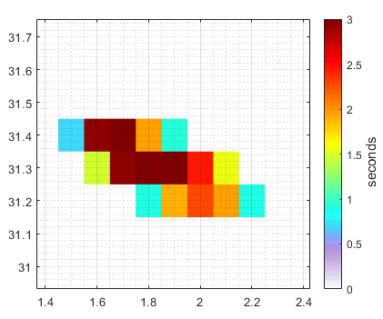

****************************
FLEXPART-NorESM 1.1
****************************

Introduction
============

FLEXPART (“FLEXible PARTicle dispersion model”) is a Lagrangian transport and dispersion model suitable for the simulation of a large range of atmospheric transport processes. Apart from transport and turbulent diffusion, it is able to simulate dry and wet deposition, decay, linear chemistry; it can be used in forward or backward mode, with defined sources or in a domain-filling setting. It can be used from local to global scale. A version of FLEXPART for use with the Norwegian Earth System Model (NorESM1-M) has been created in 2016 and since than it has been updated with the current parametrizations used in the newest FLEXPART version, as well as compatibility to run with NorESM2.

The offline FLEXible PARTicle (FLEXPART) stochastic dispersion model is currently a community model used by many scientists. The transport of pollutants, but also pysichal properties (e.g. moisture) is the main application. It provides an advanced tool to directly analyse and diagnose atmospheric transport properties of the state-of-the-art climate model NorESM in a reliable way. Extensive evaluation confirmed the effectiveness of the combined modelling system FLEXPART with NorESM in producing realistic transport statistics.

The documentation of FLEXPART-NORESM has been published in GMD and can be found here:
assiani, M., Stohl, A., Olivié, D., Seland, Ø., Bethke, I., Pisso, I., and Iversen, T.: The offline Lagrangian particle model FLEXPART–NorESM/CAM (v1): model description and comparisons with the online NorESM transport scheme and with the reference FLEXPART model, Geosci. Model Dev., 9, 4029–4048, ​https://doi.org/10.5194/gmd-9-4029-2016, 2016. 

Installation
============

The source codes of the FLEXPART-NorESM are developed and maintained on the git.nilu.no ::

   git clone https://git.nilu.no/flexpart/flexpart-noresm.git

Compilation on BETZY
============

in the directory $src ::

  module load netCDF-Fortran/4.4.5-gompi-2019a

make sure that also the INCPATH variable points to the same netCDF library version: INCPATH  = /cluster/software/netCDF-Fortran/4.4.5-gompi-2019a/include/ to makefile_noresm2 ::

  make -f makefile_noresm2 
  
  
Preparation of the FLEXPART installation
============
  
The ``pathnames`` file contains all the directories which are used by FLEXPART

In the ``pathnames`` file there is the directory of the windfield and that in the file AVAILABLE in $test there is the correct name of to the windfield. The test windfield is not part of the git, but can be found here: https://folk.nilu.no/~sabine/NSSP585frc2_f09_tn14_TESTFIELD.nc

in the second line of the ``pathnames`` file is a link to the output directory, this has to been created

Test of the FLEXPART installation
============

This test makes a backward simulation for a couple of hours from a point. The result of the simulation (variable spec001_mr), summed over all heights and time steps, should look like following plot, depicted in log10 scale)

For the test there is all control fields, as well as NorESM2 input files for a 1 days backward calculation in the distribution.
To run it you need to type ::

 salloc --nodes=1 --time=00:30:00 --qos=devel --account=nn9419k
 
 cd $test
  
 $src/flexpartnoresm
   
Modifications since version FLEXPART-NorESM 1.0 
===========

outputields in netcdf

updated scavenging parametrization (Grythe et al., 2017), https://gmd.copernicus.org/articles/10/1447/2017/

inputfile/program files defining the grid used in NorESM2 updated (grid_atm_288x192.nc)

speciesdefinition in namelist format, introduction of command line parameters

Precalculated examples
============

Based on CMIP6 simulations from NorESM2 backward calculations for a BC tracer as well as a passive tracer has been established. The receptors for the simulations are 4 different Arctic stations and the model has been run until 2100 showing weekly footprints of the air masses origin at this stations. The results can be viewed here:
https://niflheim.nilu.no/SabinePY/INES.py
