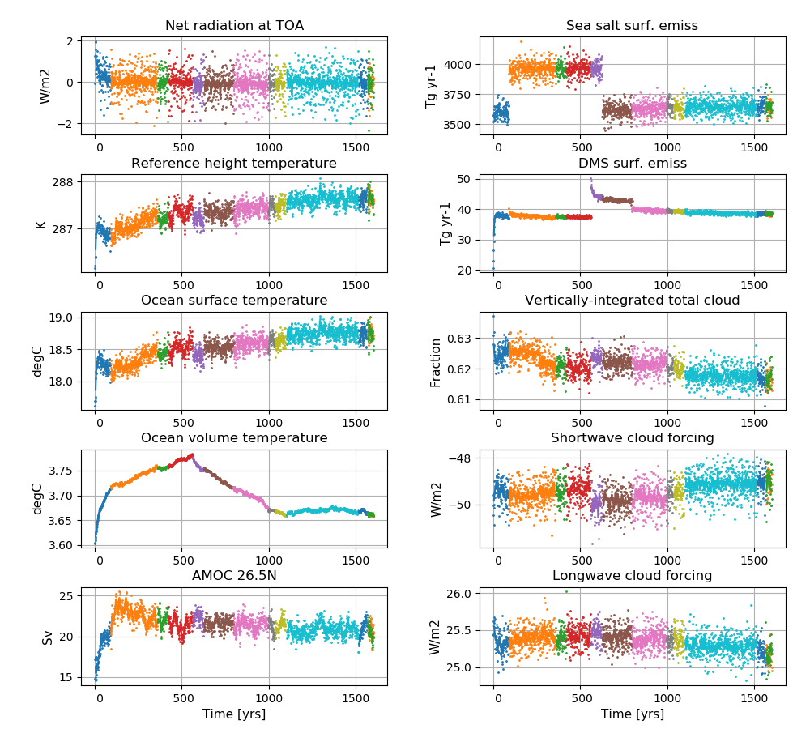

NorESM2 key simulations
=======================

For a detailed overview of the NorESM2 key simulations e.g. the spin up and CMIP6 DECK simulations, also see: 
https://noresmhub.github.io/noresm-exp/intro.html

    **Left column (from top to bottom):** Globally and annually averaged Net radiation @ top of model, Surface (2m) air temperature, Sea surface temperature (SST), global and volume averaged ocean temperature, Atlantic meridional overturning circulation (AMOC) @ 26.5N. **Right column (from top to bottom):** Globally and annually sum of Sea salt surface emissions, DMS (dimethylsulfide) surface emissions, globally and annually averaged vertically-integrated total cloud cover, shortwave cloud forcing and longwave cloud forcing.
    
