.. _archive_output:

Archiving NorESM output
=======================

Archiving of NorESM output involves three distinct processes that serve different purposes. The medium-term and long-term archiving described here depend on services provided by `sigma2 <https://www.sigma2.no>`_, but the procedures may also be relevant for other systems. 

.. _shortterm_archive:

Short-term archiving
^^^^^^^^^^^^^^^^^^^^
Short-term archiving is a phase of a NorESM model run where the generated output data is moved from ``$USERWORK/noresm/$CASE/run`` into a specific folder structure under ``$USERWORK/archive/$CASE``. Short-term archiving environment variables are set in the ``env_mach_specific.xml`` file and by default, short-term archiving is enabled. However, in the ``env_run.xml`` file it is possible to change short-term archiving settings by modifying several variables which control the behavior of short-term archiving:

.. glossary::

  DOUT_S
    If TRUE, short term archiving will be turned on.

  DOUT_S_ROOT
    Root directory for short term archiving. This directory must be visible to compute nodes.

  DOUT_S_SAVE_INT_REST_FILES
    If TRUE, perform short term archiving on all interim restart files, not just those at the end of the run. By default, this value is FALSE. 

It is also possible to move output data from ``$USERWORK/noresm/$CASE/run`` into ``$USERWORK/archive/$CASE`` without starting a new model run, e.g if the model run is not successful and stops before it is completed, the short-term archiving will not be executed. To launch only the short-term archiving script; go to the case folder and on the command line write:

On FRAM:
``sbatch --time 14:59:00 -p normal --account <project> case.st_archive`` 

On BETZY:
``sbatch --time 14:59:00 -p preproc --account <project> case.st_archive``

The memory in case.st_archive set to 120 GB. Normally, the archiving should not stop or crash but, it can happen with large file sizes. If you encounter problems with the archiving, please check the ``/cluster/work/users/$USER/archive/<case>/archive.log.*`` log file and look for completion. If the archiving did not finish completely, please rerun the script ``case.st_archive`` in the ``<case>`` folder and check the log file to see why the archiving failed. Usually, the memory and/or walltime used for archiving need to be increased; which can be modified in case.st_archive. If you notice any data corruption, please contact us.

Medium-term archiving
^^^^^^^^^^^^^^^^^^^^^
Medium-term archiving is the process of transferring NorESM output from a HPC server to a storage server. This is usually required if data should be saved for later analysis, since HPC servers typically have only limited storage capacity, and often enforce automatic deletion (auto-cleanup) on their storage space at regular intervals.

The following example consider the case of moving data from the HPC *betzy* to the storage server *nird*, but these procedures should be possible to follow on most other systems. Readers may also refer to the `sigma2 file transfer <https://documentation.sigma2.no/files_storage/file_transfer.html>`_ documentation for further information.

We generally recommend to use ``rsync`` for data transfer between servers. ``rsync`` is available on most systems, and has a wide range of useful features, including an archive mode (``-a``) and the option to preserve partial file transfers (``-P``). This last option is particularly useful for transfer of large files between remote servers, which may sometimes suffer from interruptions due to unstable network connections. One drawback with the archive mode is that ``rsync`` tries to preserve all directory and file permissions from the source server (*betzy*), whereas we usually want to apply default file permissions from the destination server (*nird*) and share data with other project members. This problem can be solved by using either the ``--chown`` or ``--no-group`` flags, depending on whether ``rsync`` is running from the source server or destination server.

Running ``rsync`` from *nird*::

  rsync -aP --no-group <username>@betzy.sigma2.no:<path/to/noresm/output> <path/to/project/storage>

Running ``rsync`` from *betzy*::

  rsync -aP --chown=OWNER:GROUP <path/to/noresm/output> <username>@login.nird.sigma2.no:<path/to/project/storage>

For *nird* it is sufficient to use the ``--no-group`` flag, then the files and directories will automatically get the default group settings for the destination project directory. For *betzy* it is necessary to use ``--chown=OWNER:GROUP`` to obtain the same effect, where ``OWNER`` is the username for the person making the file transfer and ``GROUP`` is the project account (e.g. ``ns9252k``). It is possible to use the ``--no-group`` also from the source server, but this will only apply the destination group settings for directories. If file permissions are not updated during the data transfer, it is possible to do this on *nird* after the data transfer by running ``chown -R USER:GROUP`` on the archive directory that has been transferred.

If for some reason ``rsync`` is not applicable, it is possible to use other applications such as ``sftp`` or ``scp``, for instance::

  scp -r <path/to/noresm/output> <username>@login.nird.sigma2.no:<path/to/project/storage>

Long-term archiving
^^^^^^^^^^^^^^^^^^^
Long-term archiving is the process of transferring NorESM output from the NIRD storage to the NIRD research archive. This is usually done after the data has been cmorized and/or published to an ESGF node. The data is typically stored 5 - 10 years or longer. After the data has been uploaded and archived, the copy on NIRD storage should be deleted to save storage space.

The main documentation, `Research Data Archive User-Guide <https://documentation.sigma2.no/nird_archive/user-guide.html>`_ is found on the sigma2 site. The archiving is done by filling in a web-form, and the documentation includes most of the screenshots needed to see which metadata are required to fill them in. Mark the notes in the documentation on the constraints of the web-form.

Sigma2 are in their finalizing stages on creating an API for archiving data programatically, so this procedure may become simpler in the future. We are in dialog with sigma2 to make this API fit our needs.

Below are supplementary screenshots to the sigma2 user-guide, which also shows how to get hold of the metadata from the ESGF node.

Visit the noresm2cmor repository:

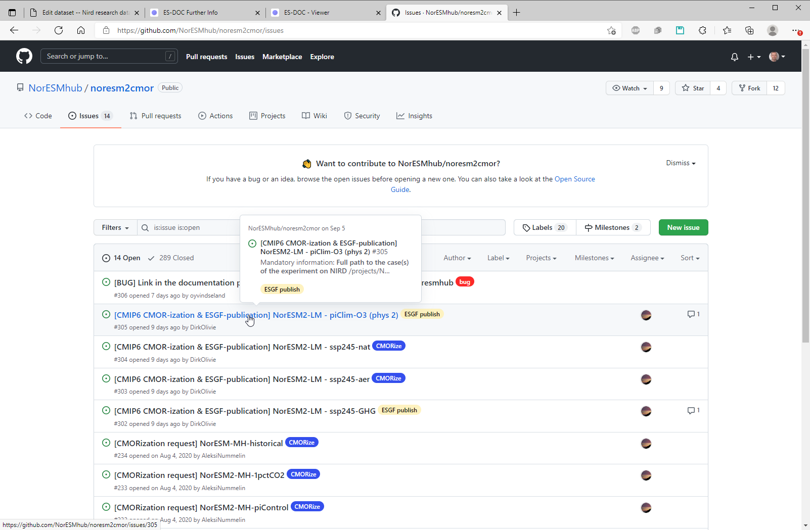

Find the published data:

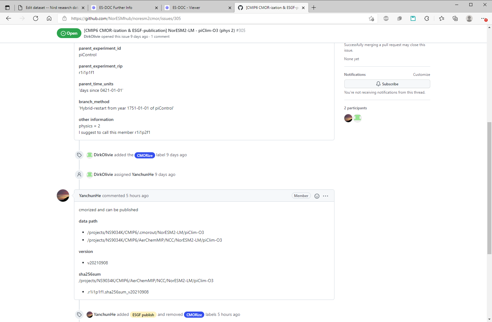

Extract the ``:further_info_url`` from the data:

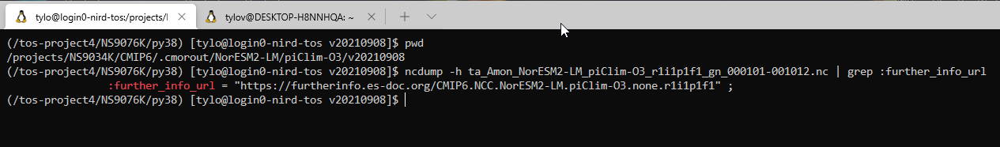

Further info page:

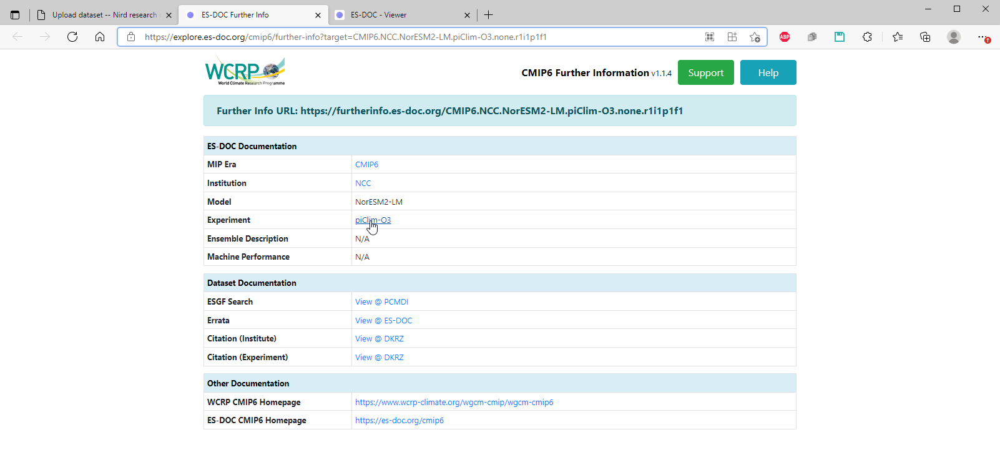

Find the metadata on the ES-DOC pages, and login to `NIRD research archive <https://archive.sigma2.no>`_ and start the deposit-dataset 
web-form:

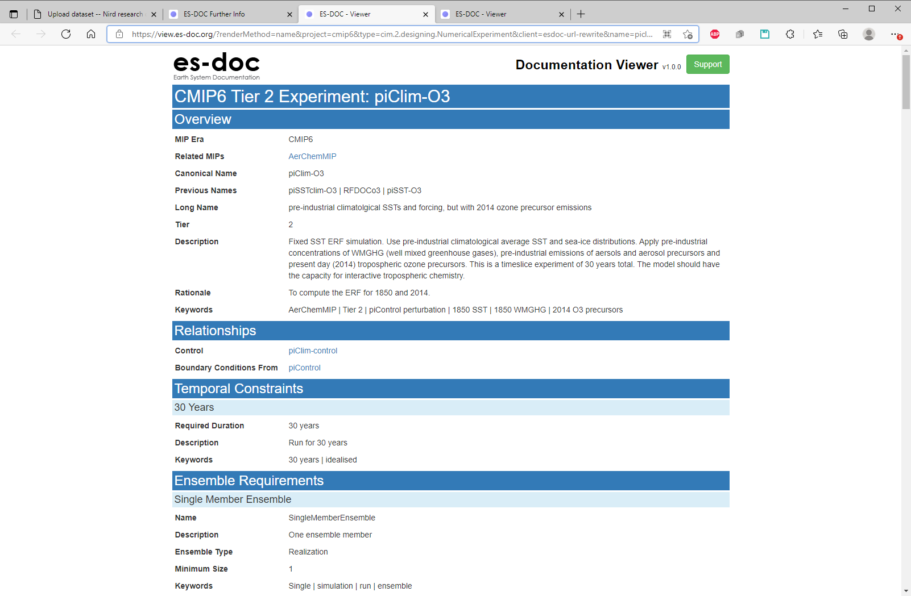

Page 1:

.. image:: images/long-term-archive-06.png
   :width: 800

Page 2a:

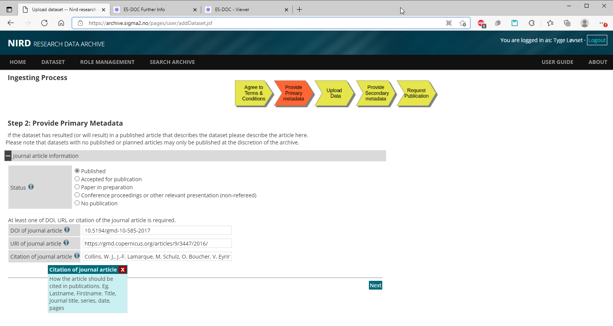

Page 2b:

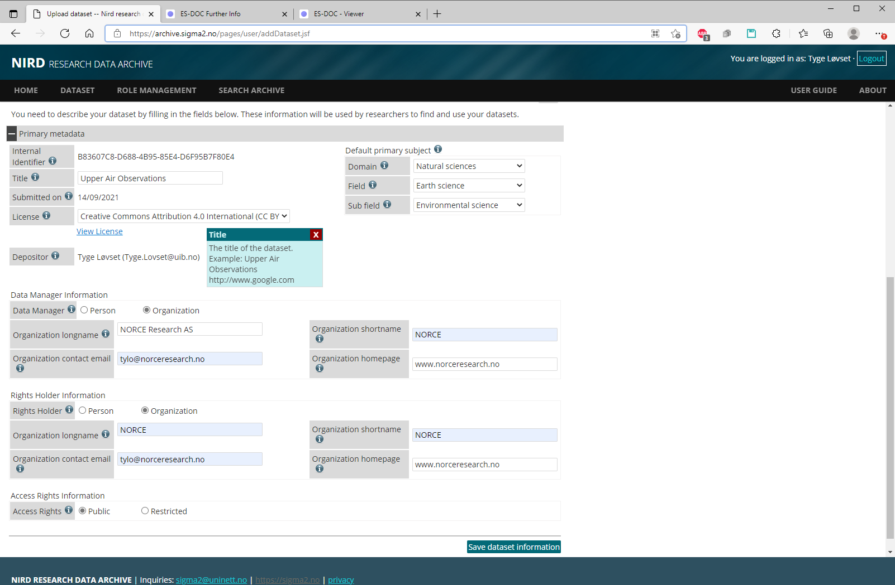

Page 3a:

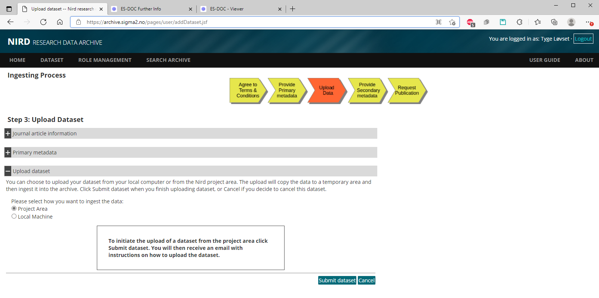

Page 3b:

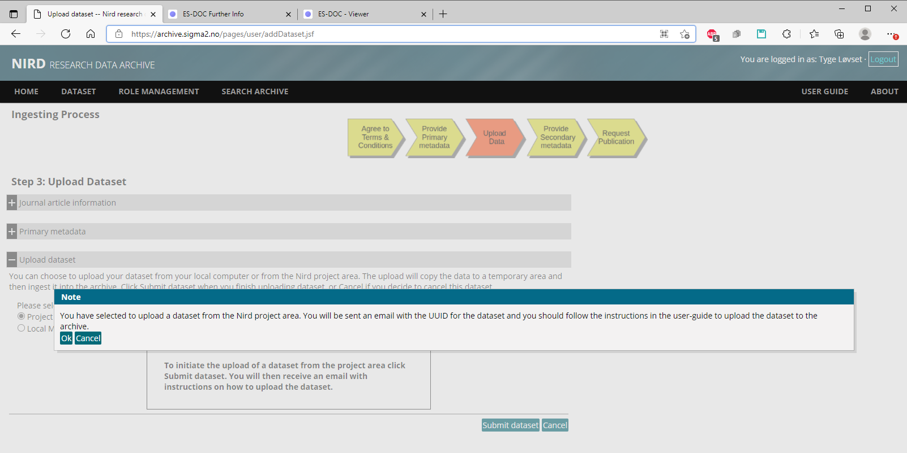

Auto-reply from sigma2:

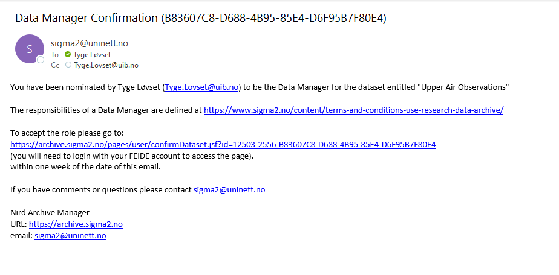

The registered archive info:

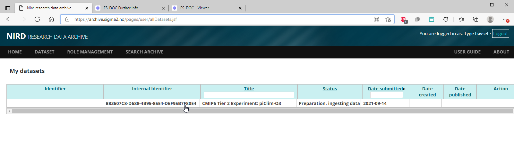

Page 4a:

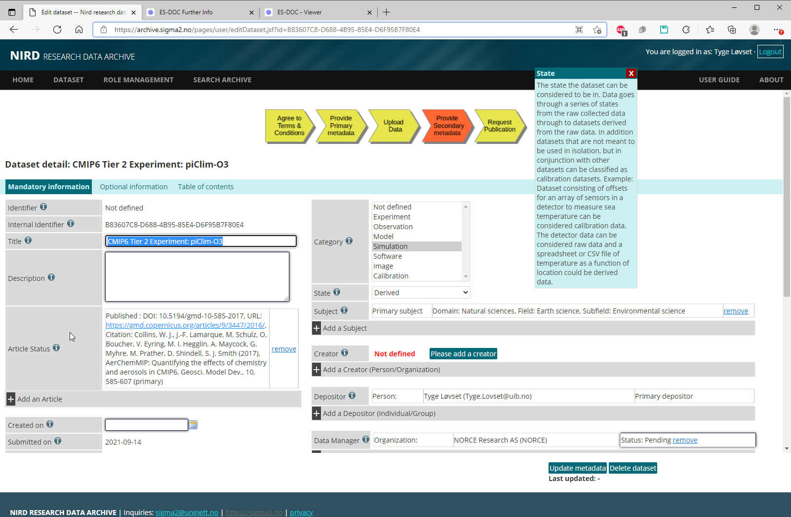

Page 4b:

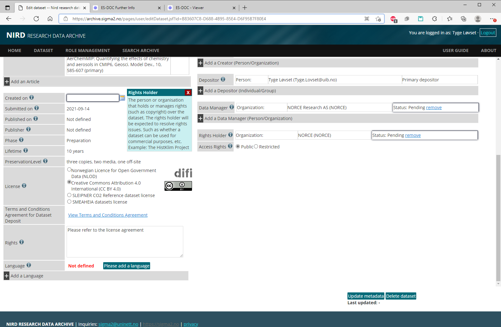
